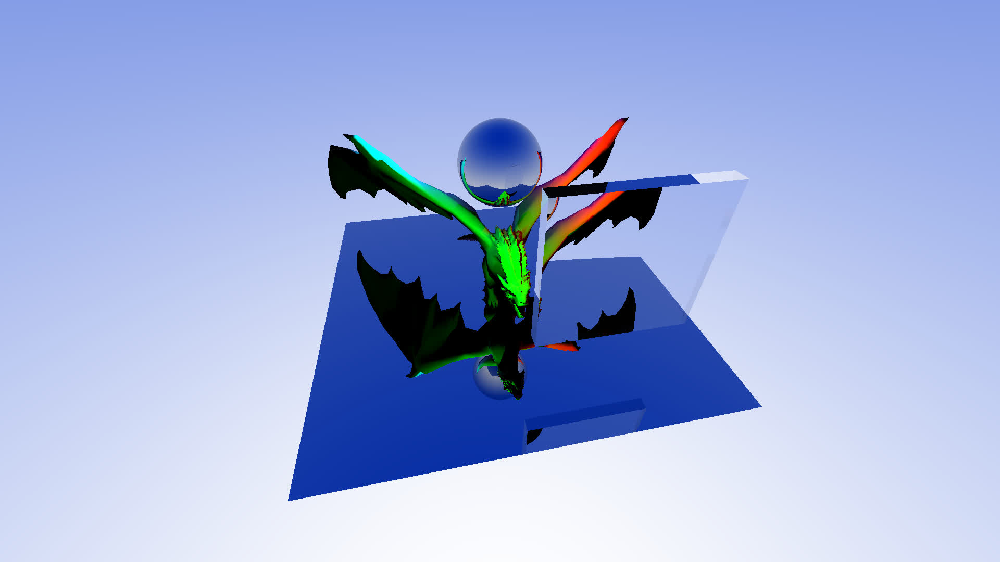

# 🟥 The Chaos Project


## Overview
Chaos Project is a ray tracing engine build as part of [Chaos Camp 2026](https://www.chaos.com/chaos-camp), specifiaclly its Ray Tracing course. The ray tracer is implemented in C++ 14 and uses multithreading, currently it's CPU-based.

For now, the project works only with *.crtscene* files as input and only renders images in *.ppm* file format.

[This](./demo/Ray%20Tracer.pptx) is the project presentation for the closing of Part 1 of the course, showing the project's structure and functionality as it was at the end of August.

### Structure
Base types: Vector3, Point3 (alias for Vector3), Color
...

## Features
### Implemented
Geometry:
- triangle meshes
- procedural spheres

Materials:
- smooth shading
- flat shading
- relfective materials
- refractive materials

Lights:
- point light
- colored lights
- movable lights

Optimization:
- multithreaded bucket rendering
- axis-aligned bounding boxes (AABBs) per each mesh

### To be implemented
- bounding volume hierarchy (BHV) tree structure with an array implementation that stores a mesh's geometry in AABBs in a recrsive fashion
- BHV structure that stores the hittable elements of the scene
- support for *.blend* files as input scenes or converstion from *.blend* to *.crtscene* format

## Usage

Using the ray tracer:
1. Build the application
In VS Code that would be:
```
mkdir build
cd build
cmake ..
cmake --build . --target raytracer
```

2. Run the executable *raytracer.exe* with two arguments: the first is the *.crtscene* file representing the scene you want to render, the second - the *.ppm* output image file.

```
<path-to-executable>/raytracer scene0.crtscene output.ppm
```

"scenes" - directory containing the *.crtscene* files you want to render</br>
"rendered" - directory where your rendered results will be exported
